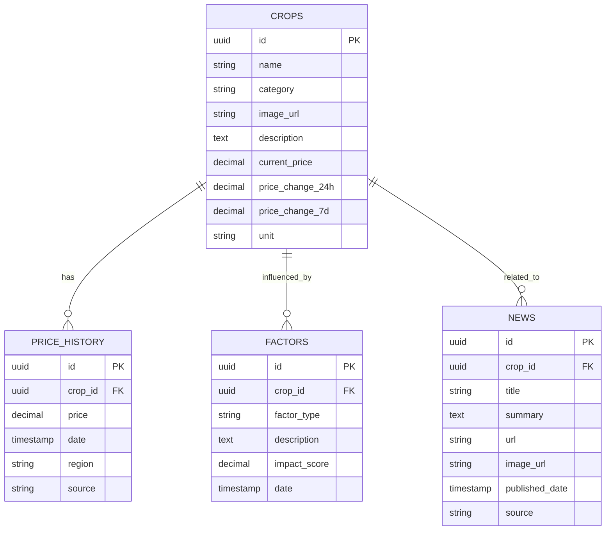

# Data Model: AgroVision Core Platform

**Feature**: Core Platform (001)
**Database**: PostgreSQL (Supabase)

## Entity Relationship Diagram

## Table Definitions

### `crops`

Core entity representing agricultural products.

- `id`: UUID, Primary Key
- `name`: Text, Unique (e.g., "Wheat")
- `category`: Text (e.g., "Grains", "Vegetables")
- `image_url`: Text (URL to image asset)
- `description`: Text
- `current_price`: Decimal (Cached latest price for quick access)
- `price_change_24h`: Decimal (Percentage change)
- `price_change_7d`: Decimal (Percentage change)
- `unit`: Text (e.g., "₹/quintal", "$/bushel")

### `price_history`

Historical pricing data for charting and analysis.

- `id`: UUID, Primary Key
- `crop_id`: UUID, Foreign Key -> crops.id
- `price`: Decimal
- `date`: Timestamp
- `region`: Text (e.g., "Punjab", "Kansas")
- `source`: Text (e.g., "USDA", "Local Mandi")

### `factors`

Influencing factors for price prediction and explanation.

- `id`: UUID, Primary Key
- `crop_id`: UUID, Foreign Key -> crops.id
- `factor_type`: Text ('weather', 'supply', 'demand', 'policy')
- `description`: Text
- `impact_score`: Decimal (-100 to +100, representing % impact)
- `date`: Timestamp

### `news`

Aggregated news articles.

- `id`: UUID, Primary Key
- `crop_id`: UUID, Foreign Key -> crops.id (Nullable, if general news)
- `title`: Text
- `summary`: Text
- `url`: Text
- `image_url`: Text
- `published_date`: Timestamp
- `source`: Text
